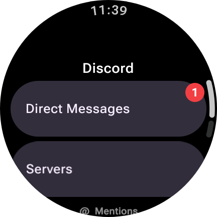
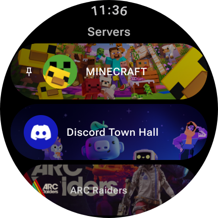
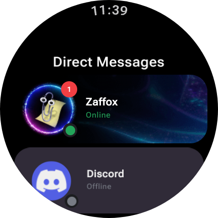
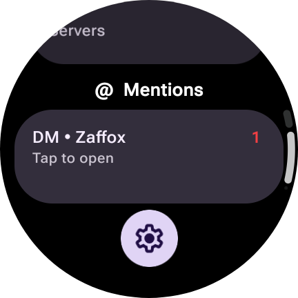
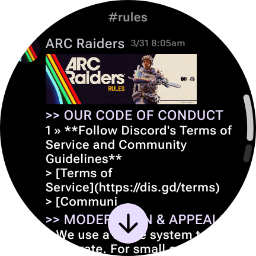
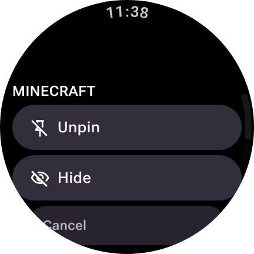

Some updates should be comming soon, working on threads and other minor changes :3 

# Discord-wear
Discord For WearOS
### 3RD PARTY CLIENTS VIOLATE DISCORDS TERMS OF SERVICE
### I AM NOT RESPONSIBLE FOR ANY BANS

Note:there are very few reports of actual bans for 3rd party cilents alone.

Unless you trigger something that triggers a captcha you are fine 99.9% of the time

  
Screenshots

  
 
 

 
 

Localhost website for token input on device on same LAN
192.168.1.123:1234 and it shows a basic webite so you dont have to type on a small screen :3

Known Bugs:
- Samsung keyboard does not work, Use Gboard instead, Samsung keyboard is bugged

Currently working:
- Messages
- Embeds
- Server Stickers and Emoji
- Profile Images
- Replys
- Audio/Voice messages (can't send though)
- videos have partal supoort
- Nameplates
- Fowarded messages

Not Working
- bot commands

what will Never work or be implemented
- voice calls (E2E Requirement)
- Joining server (Captha)
_

Please check this page for updates often to get nwe features and bug fixes
(Auto update check comming soon)
